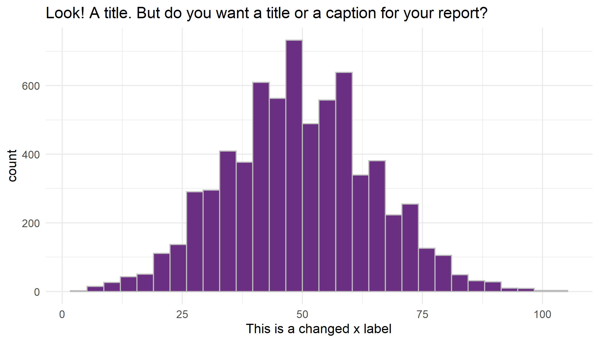

```{r, message = FALSE, echo = FALSE}
library(tidyverse)
library(lme4)
library(knitr)

# this should supress all code and messages
knitr::opts_chunk$set(echo=FALSE, message = FALSE, warning = FALSE, fig.align = "center", fig.height = 3.5)
```

```{r}
# read in the data
curr_employee <- read_csv("data/black-saber-current-employees.csv")
hire_phase1 <- read_csv("data/phase1-new-grad-applicants-2020.csv")
hire_phase2 <- read_csv("data/phase2-new-grad-applicants-2020.csv")
hire_phase3 <- read_csv("data/phase3-new-grad-applicants-2020.csv")
hire_final <- read_csv("data/final-hires-newgrad_2020.csv")
```


# General comments (you can delete this section)

_You can delete this section, and if you want to check what it said, just open a template from the package again. You don't have to use this particular template, but you DO need to write you report in RMarkdown and include a cover page._

_The cover page must have:_

*	_A title and subtitle_
* _"Report prepared for Black Saber Software by" your company name_
*	_Date (assessment submission date is fine)_

_You can change the colour of this cover to any colour you would like by replacing 6C3082 in the YAML above (line 11) to another hex code. You could use this tool to help you:_ https://htmlcolorcodes.com/color-picker/

\newpage
# Executive summary

_Guidelines for the executive summary:_

* _No more than two pages_
* _Language is appropriate for a non-technical audience_
* _Bullet points are used where appropriate_
*	_A small number of key visualizations and/or tables are included_
*	_All three research questions are addressed_


\newpage
# Technical report
_This part of the report is much more comprehensive than the executive summary. The audience is statistics/data-minded people, but you should NOT include code or unformatted R output here._


## Introduction

_Provide a brief introduction to your report and outline what the report will cover. This section is valuable for setting scope and expectations. _

### Research questions
_Use bullet points to to describe the research questions you are going to address. Write in full sentences._

- Is gender a significant determinant of being a successful applicant in each hiring phase?

## Is gender a significant determinant of being a successful applicant in each hiring phase?

### Data Manipulation & Exploratory plots/summary tables

```{r}
# add indicator variables of whether the applicant passed phase-I
success <- hire_phase2$applicant_id
hire_phase1 <- hire_phase1 %>% 
  mutate(pass = ifelse(applicant_id %in% success, 1, 0))

# add indicator variables of whether the applicant passed phase-II
success_2 <- hire_phase3$applicant_id
hire_phase2 <- hire_phase2 %>% 
  mutate(pass = ifelse(applicant_id %in% success_2, 1, 0))

# add indicator variable of whether the applicant passed phase-III
success_3 <- hire_final$applicant_id
hire_phase3 <- hire_phase3 %>% 
  mutate(pass_final = ifelse(applicant_id %in% success_3, 1, 0))
```

Table 1: Conditional probability table for the three phases of hiring

\begin{table}[]
\begin{tabular}{|c|c|c|c|c|c|c|}
\hline
Gender            & \multicolumn{2}{c|}{Phase 1} & \multicolumn{2}{c|}{Phase 2} & \multicolumn{2}{c|}{Phase 3} \\ \hline
                  & Does not pass     & Pass     & Does not pass     & Pass     & Does not pass     & Pass     \\ \hline
Man               & 0.467             & 0.483    & 0.468             & 0.682    & 0.583             & 0.800    \\ \hline
Prefer not to say & 0.026             & 0.010    & 0.011             & 0.000    &                   &          \\ \hline
Woman             & 0.508             & 0.507    & 0.522             & 0.318    & 0.417             & 0.200    \\ \hline
\end{tabular}
\end{table}

```{r, fig.cap="Proportion of people passed phase I by gender and cv"}
hire_phase1_temp <- hire_phase1 %>% 
  mutate(cover_letter = as.factor(ifelse(cover_letter == 0, "No", "Yes"))) %>% 
  mutate(cv = as.factor(ifelse(cv == 0, "No", "Yes"))) %>% 
  mutate(pass = as.factor(ifelse(pass == 0, "No", "Yes")))

# proportion of successful applicants within each sex group
hire_phase1_temp %>% 
  ggplot(aes(x = cv, fill = as.factor(pass))) +
  geom_bar(position = "fill") +
  facet_wrap(~gender) +
  scale_fill_manual(values = c("#fa8154", "#51c6b9")) +
  ylab("Proportion") +
  theme_minimal() +
  labs(fill = "Pass", x = "CV", y = "Proportion")
```

```{r, fig.cap="Proportion of people passed phase I by gender and cover letter"}

# proportion of successful applicants vs. gender and cover letter
hire_phase1_temp %>% 
  ggplot(aes(x = cover_letter, fill = as.factor(pass))) +
  geom_bar(position = "fill") +
  facet_wrap(~gender) +
  scale_fill_manual(values = c("#fa8154", "#51c6b9"))+
  ylab("Proportion") +
  theme_minimal() +
  labs(fill = "Pass", x = "Cover letter", y = "Proportion")
```

By looking at the data for each phase, we can figure out which applicants successfully passed the previous phase by looking at the common *id*s between two phases. For instance, applicants included in the phase II data set are the ones who passed phase I. Following this logic, we create a new variable in each phase that takes value of 1 if the candidate passed this phase, and 0 otherwise. 

After creating the indicator variable, we then looked at the proportion of different gender passing each phase. Referring to *Table 1*, in phase I, 48.3% male, 50.7% female, and 1% prefer not to say passed this phase. There seems to be an even split between males and females who successfully passed the phase. Moving on to phase II, the split between males and females become a bit uneven, as among all those passed the phase, 68.2% are males while 31.8% are females, with 0% of prefer not to say. Lastly, in phase III, the ratio of males to females who passed this phase becomes 4:1. This preliminary observation leads us to think whether the selection algorithm is based solely on candidates' skills, or does gender affects the probability of a candidate being selected as successful candidate? If gender does play a role, then how big is the impact?

To investigate the question, we drew out some exploratory plots. We found that in the phase I selection, all the candidates who did not submit a CV or a cover letter did not pass phase I, as *Figure 1* and *Figure 2* shows. Hence, if a candidate did not submit these two files, then other potential determinants for success like *GPA* and *work experience* become irrelevant in determining whether the candidate passes the current phase. Therefore, we decide to filter out the observations that do not have a CV/cover letter present in phase I, which reduces out sample size from 613 observations to 355 observations. Even though there is a large reduction in the sample size, we think the manipulation is necessary as we can investigate how other factors play a role in the selection process. 

### Models

We have a binary response variable that indicates whether the applicant passed the phase. Also,since our observations are independent, with one applicant being one observation, a logistic model seems appropriate under this circumstance. Hence, in phase-I and phase-II, we adopt a logistic model with logit link to model the relationship among the response and the potential factors that influence the odds of being a successful candidate. 

Table 2: Coefficient estimates for the logistic model built for hiring phase-I

```{r}
# filter out observations without cv or cover letter
hire_phase1_filtered <- hire_phase1 %>%
  filter(cv == 1) %>%
  filter(cover_letter == 1)

# build model
hire1_mod <- glm(pass ~ gpa + extracurriculars + work_experience, family = binomial(), data = hire_phase1_filtered)

# table for reporting
ests_h1 <- format(round(exp(summary(hire1_mod)$coef)[, 1], 2), nsmall = 2)
hire1_ci <- confint(hire1_mod)
cis_h1 <- round(exp(hire1_ci), 6)[-1,]
cis_h1 <- str_c("(", trimws(cis_h1[, 1]), ", ", cis_h1[, 2], ")")
pval_h1 <- round(summary(hire1_mod)$coefficients[, 4], 4)
hire1_rownames <- c("Baseline odds", "GPA", "Extracurriculars", "Work experience")

hire1_colnames <- c("Estimates", "95% CI", "P-value")

hire1_mod_table <- cbind(ests_h1, cis_h1, pval_h1)
rownames(hire1_mod_table) <- hire1_rownames
colnames(hire1_mod_table) <- hire1_colnames
knitr::kable(hire1_mod_table, align = c("r", "r"))
```

```{r}
# hire1_mod_wg <- glm(pass ~ gender + gpa + extracurriculars + work_experience, family = binomial(), data = hire_phase1_filtered)
# lmtest::lrtest(hire1_mod, hire1_mod_wg)
```

Table 3: Coefficient estimates for the logistic model built for hiring phase-II

```{r}
# build model
hire2_mod <- glm(pass~technical_skills + writing_skills + leadership_presence + speaking_skills, family = binomial(), data = hire_phase2)

hire2_ci <- confint(hire2_mod)

# table for reporting
ests_h2 <- format(round(exp(summary(hire2_mod)$coef)[, 1], 2), nsmall = 2)
cis_h2 <- round(exp(hire2_ci), 2)
cis_h2 <- str_c("(", trimws(cis_h2[, 1]), ", ", cis_h2[, 2], ")")
pval_h2 <- round(summary(hire2_mod)$coefficients[, 4], 4)
hire2_rownames <- c("Baseline odds", "Technical skills", "Writing skills", "Leadership_presence", "Speaking_skills")

hire2_colnames <- c("Estimates", "95% CI", "P-value")

hire2_mod_table <- cbind(ests_h2, cis_h2, pval_h2)
rownames(hire2_mod_table) <- hire2_rownames
colnames(hire2_mod_table) <- hire2_colnames
knitr::kable(hire2_mod_table, align = c("r", "r"))
```

```{r}
# hire2_mod_wg <- glm(pass~gender + technical_skills + writing_skills + leadership_presence + speaking_skills, family = binomial(), data = hire_phase2)
# 
# lmtest::lrtest(hire2_mod, hire2_mod_wg)
```

With phase-II data, the model can be written out as follows: $$log(\frac{\mu_2}{1-\mu_2}) = \beta_0 + \beta_1 *\text{Technical skills} + \beta_2 *\text{Writing skills} + \beta_3 * \text{Leadership presence} + \beta_4 * \text{Speaking skills}$$. 

$\mu$: the probability of a candidate passing phase-II
$\beta_i$: coefficient for each variable

According to the model, we include each candidate's scores on *technical skills*, *writing skills*, *leadership presence* and *speaking skills* as our predictors. From the results, we see that the effect of all four predictors are significantly positive, with the odds ratio for *technical skills*, *writing skills*, *leadership presence*, and *speaking skills* being 1.08, 1.09, 2.53, and 2.01. The p-values for the 4 predictors are all significant. Taking the odds ratio of *technical skills* as an example, it means that with a 1 unit increase in *technical skills*, the odds of being a successful candidate in phase-II is 1.08 times higher. 

To investigate whether gender plays a significant role in the phase-II selection, we include *gender* as our predictor in addition to the original four. Then, by performing a Likelihood ratio test, we found that the p-value is around 0.41, suggesting that we lean more towards the simpler model that does not include *gender* as one of its predictors. 


```{r, fig.cap="Histogram of the total scores vs. whether the candidate with the score passed phase-III"}
hire_2_3 <- hire_phase3 %>% 
  mutate(total = interviewer_rating_1 + interviewer_rating_2)%>% 
  mutate(`Pass` = as.factor(ifelse(pass_final == 1, "Yes", "No"))) %>% 
  arrange(desc(total)) %>% 
  left_join(hire_phase2, by = "applicant_id") %>% 
  select(applicant_id, gender, total, `Pass`)

hire_2_3 %>% 
  ggplot(aes(x = total, fill = `Pass`)) +
  geom_histogram(color = "white") +
  theme_minimal() +
  scale_fill_manual(values = c("#fa8154", "#51c6b9")) +
  labs(x = "Total score") + 
  facet_wrap(~gender)
```

Table 4: Phase-II information for the two applicants with a tie in phase III

```{r}
hire2_temp <- hire_phase2 %>% 
  filter(applicant_id == 1600 | applicant_id == 3560) %>% 
  select(applicant_id, gender, technical_skills, writing_skills, leadership_presence, speaking_skills)
colnames(hire2_temp) <- c("Applicant id", "Gender", "Technical skills", "Writing skills", "Leadership presence", "Speaking skills")

knitr::kable(hire2_temp)
```

*Figure 2* shows the distribution of the total scores earned by candidates which is constructed from summing up the two *interview ratings*. From the plot, we see that most candidates with the highest scores are recruited. However, there are two candidates with a total score of 153, where only one of them is recruited who is a male. Hence, to explore further, we went back to the phase-II data and filter out these two observations.

### Conclusions

As *Table 4* shows, the male has higher scores in *technical skills*, while the female is better at categories like *writing skills*, *leadership presence*, and *speaking skills*. According to our phase-II model, *leadership presence* and *speaking skills* seems to have larger effect on the odds ratio than the other two determinants do. So, we would expect the female to be selected as a successful candidate instead of the male. 


## Informative title for section addressing a research question

_For each research question, you will want to briefly describe any data manipulation, show some exploratory plots/summary tables, report on any methods you use (i.e. models you fit) and the conclusions you draw from these_

```{r}
# This chunk provides an example of some things you can do with RMarkdown to make your report creation process easier

# read in the data
black_saber_current_employees <- read_csv("data/black-saber-current-employees.csv")

# create a visualisation
my_plot <- black_saber_current_employees %>% 
  ggplot(aes(x = productivity)) +
  geom_histogram(colour = "grey", fill = "#6C3082") +
  theme_minimal() +
  labs(title = "Look! A title. But do you want a title or a caption for your report?", x = "This is a changed x label")

# save your plot in your images folder, you can specify the height and width, too
# saving this means you can add the image to your exectuve summary without having to run or rerun the code, if you wish
ggsave("images/example.png", width = 7, height = 4)

# norice how the image is included with the  below
```



## Informative title for section addressing a research question

```{r, include = FALSE}
library(tidyverse)
library(lme4)
```

## Discussion

_In this section you will summarize your findings across all the research questions and discuss the strengths and limitations of your work. It doesn't have to be long, but keep in mind that often people will just skim the intro and the discussion of a document like this, so make sure it is useful as a semi-standalone section (doesn't have to be completely standalone like the executive summary)._

### Strengths and limitations

\newpage
# Consultant information
## Consultant profiles

*This section is only marked for completeness, clarity and professionalism, not 'truth' so you can write it as if we're a few years in the future. Put your current degree in as completed and/or add your first choice grad school program, whatever you like. What skills related skills would you most like to highlight? What job title do you want?*

**Ke Deng**. Ke Deng is a junior analyst at the ProDasta Consulting Company, where she does report writing and data analysis for clients. She graduated from the University of Toronto with a Bachelor degree of Science, and is currently enrolled in the graduate program. Ke specializes in Statistics, with a focus in economics. She has been with the ProDasta Consulting Company since the company started. Ke is currently employed as the report writer and consulter of the company and she is great at writing and polishing reports for the clients.

**Wenqing Hao**. Wenqing Hao is an experienced analyst at the ProDasta Consulting Company, also one of the four co-founders  of the Company. She holds a Bachelor degree of Science from the University of Toronto, focusing on both Statistics and Financial economics. She has a strong background of  managing business operations and finance projects. Over the past few years, she cooperates well and closely with the other three co-founders, generating a rather professional team to successfully satisfy clients’ various requests.    

**Qihui Huang**. Qihui Huang, an junior analyst working at ProDasta Consulting Company. Qihui has studied Statistics at University of Toronto for 3 years, and aims to graduate with a Bachelor of Science degree in Statistics. She also has 1 year experience in data related roles. In her study and work, Qihui developed a time management guide to help her co-workers manage stress and emotion. On weekends, she likes to go hiking with her friends or reading books.

**Qing Wen**. Qing, commonly referred to as Chelsea, is an analyst at the ProDasta Consulting Company. She graduated from the University of Toronto with a degree in applied statistics, focusing on economics. Qing joined ProDasta during her pursuit of a graduate degree in business analytics. With 3 years of experience working with clients, Qing handles clients’ requests with her passion and expertise. She enjoys communicating with the clients in casual ways to solve their problems using her outstanding analytical skills, as well as helping colleagues to improve the productivity of the whole team.


## Code of ethical conduct
 
**ProDasta Company Ethics Statement**
1. ProDasta Consulting Company seeks to have high professional standards within the development, usage and enforcement and keeps a high standard for having the reputation of statistical practices. We state to do the best of setting standards for the Statistics field and for Statisticians, avoid any wrong actions. 
2. ProDasta Consulting Company and the employees take on the responsibility of work. We refuse to deliver any wrong statements that can cause damage to the professional statistical fields.
3. We support and welcome any statisticians in their professional field. We act with integrity and dignity toward the fellow statisticians, and provide opportunities for them to the professional field. 


__Final advice: KNIT EARLY AND OFTEN!__
